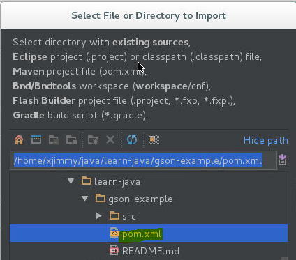
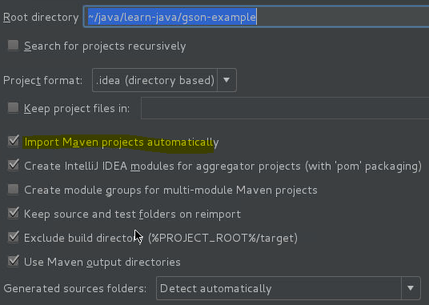
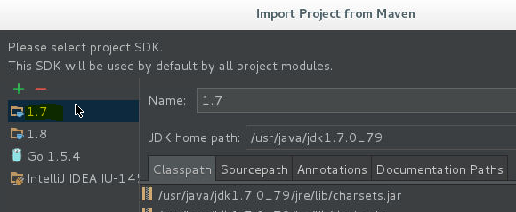
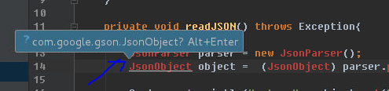
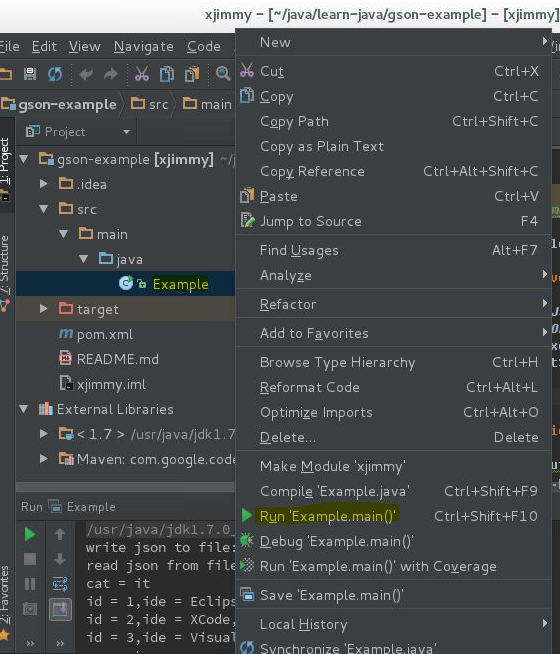

Example for write/reader json with gson
=======================================

# prerequisite

- jdk 1.7+
- maven 3+
- intellij idea 2016+


# build

## use maven
```
//compile
$ mvn compile

//run
$ mvn exec:java -Dexec.mainClass=Example
[INFO] Scanning for projects...
...
[INFO] --- exec-maven-plugin:1.5.0:java (default-cli) @ xjimmy ---
write json to file:/home/xjimmy/test.json
read json from file:/home/xjimmy/test.json
cat = it
id = 1,ide = Eclipse,name = java
id = 2,ide = XCode,name = Swift
id = 3,ide = Visual Studio,name = C#
pop = true
[INFO] ------------------------------------------------------------------------
...
```

## use java command line
```
$ cd src/main/java

//set env
$ export JAVA_HOME=/usr/java/jdk1.7.0_79
$ export PATH=$JAVA_HOME/bin:$PATH$
$ export CLASSPATH=.:$JAVA_HOME/lib/dt.jar:$JAVA_HOME/lib/tools.jar:$HOME/.m2/repository/com/google/code/gson/gson/2.7/gson-2.7.jar

//compile
$ javac Example.java

//run
$ java Example
write json to file:/home/xjimmy/test.json
read json from file:/home/xjimmy/test.json
cat = it
id = 1,ide = Eclipse,name = java
id = 2,ide = XCode,name = Swift
id = 3,ide = Visual Studio,name = C#
pop = true
```

## use intellij idea

*import project*







*import prompt*



*run*


